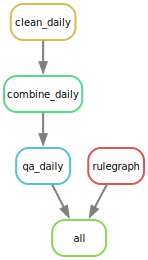

# scrape_tfl_ins_outs

## Usage

Download files from the [TFL dashboard](https://app.powerbi.com/view?r=eyJrIjoiZDgwZWY4NWMtZTFkMi00YzM2LThiMWQtNzg2ZTc2YjliNzM2IiwidCI6IjFmYmQ2NWJmLTVkZWYtNGVlYS1hNjkyLWEwODljMjU1MzQ2YiIsImMiOjh9) and name with the pattern `data/tfl_daily/{type}/raw/{station}.json`.

Run the workflow with:

```shell
snakemake -j1
```

## Workflow Diagram

